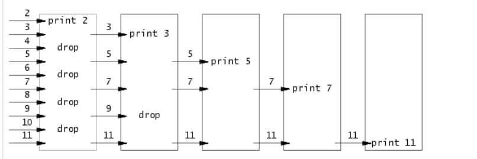
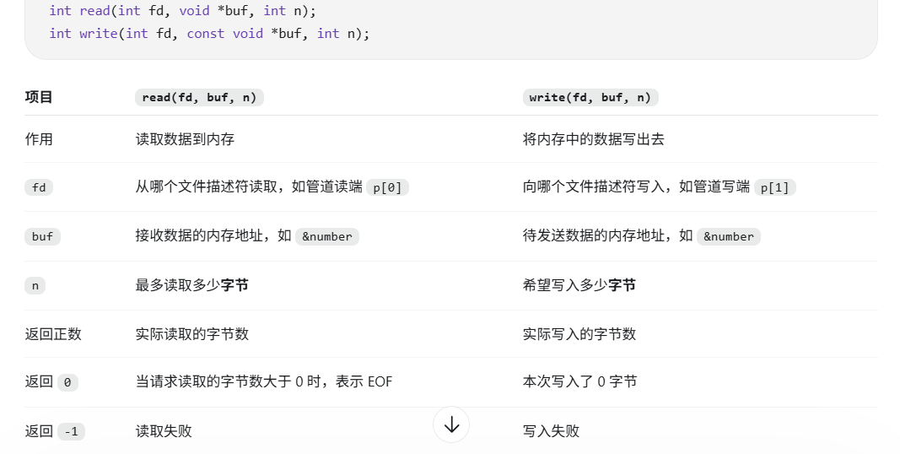
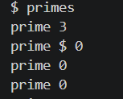

---
title: MIT 6.S081 Lab1

author: Muelsyse

pubDatetime: 2026-09-05T19:22:42+08:00

featured: true

draft: false

tags:
  - Operating System

series: MIT6.S081

description: "MIT6.S081 Lab1 笔记"
---


保研复习的时候十分好奇OS到底是怎么实现的, 厌倦了只看知识点的走马观花复习, 所以选了 MIT 6.S081 的 操作系统课想要深入了解一下. 以下是Lab1的我的解答.

Boot xv6 这一步我让codex 帮我做了 电脑上有 ubuntu 所以不算困难.

## Sleep

这个是让实现 `sleep` 这个命令, 比如 `sleep(10)` 就是等待 10 个 tick, 而不是10秒. 下面是 xv6 系统的实现 sleep 系统调用的内核代码, sys_sleep 没有参数 用户调用 `sleep(10)` 时，参数放在 RISC-V 的 `a0` 寄存器中；进入内核后，寄存器被保存到进程的 `trapframe`。 `argint(0, &n)` 中 `0` 表示读取系统调用的第一个参数, 赋值到 `n`. `tscks0` 记录开始等待的时钟值.  `trcks` 是内核维护的全局时钟计数, 时钟中断处理会执行 `ticks++; wakeup(&ticks)`.

``` cpp
uint64
sys_sleep(void)
{
  int n;
  uint ticks0;

  if(argint(0, &n) < 0)
    return -1;
  acquire(&tickslock);
  ticks0 = ticks;
  while(ticks - ticks0 < n){
    if(myproc()->killed){
      release(&tickslock);
      return -1;
    }
    sleep(&ticks, &tickslock);
  }
  release(&tickslock);
  return 0;
}
```
`sleep` 的实现比较简单, 注意参数的读入即可, `argc` 表示算上命令一共几个字符串, `argv` 数组存储传入的参数, 一般 `argv[0]` 存储命令本身, 最后存储 `0` 代表结束. 实现 `sleep` 只需要一个参数. 检查后调用提供的 `sys_sleep` 的用户接口 `sleep(int n)`.

``` cpp
#include "kernel/types.h"
#include "kernel/stat.h"
#include "user/user.h"

int
main (int argc, char *argv[])
{
  if(argc != 2){
    fprintf(2, "Usage: need a number for time to sleep.\n");
    exit(1);
  }

  int time = atoi(argv[1]);
  if(time < 0){
    fprintf(2, "Time must be non-negative.\n");
    exit(1);
  }

  sleep(time);

  exit(0);
}
```

## pingpong

这个涉及到了 `pipe` 和 `fork`, 先讲讲这两个系统调用:

### pipe

pipe 是用于进程间通信的一种方式, 其实质是通过`read` 端和 `write`端暴露给进程的 `kernel buffer`. 创建 `pipe`时会绑定两个 `file descriptor`, 一个用于读,一个用于写, 通常我们使用 `int p[2]; pipe(p);` 之后 `p[0]` 表示读, `p[1]` 表示写, `pipe()` 返回值小于0说明创建失败.

### fork

fork 挺有意思, 会在当前进程创建一个子进程, 通过 `fork()` 返回值区分, 返回值为 `0` 表示子进程, 大于 `0` 表示父进程, 否则创建失败.

fork() 创建一个拥有独立地址空间的子进程, 初始内存内容与父进程相同. 同时, 子进程继承父进程的文件描述符, 各自的描述符表项引用相同的内核文件对象. 因此, 继承的普通文件描述符共享文件偏移量; 继承的管道描述符访问同一条管道, 其中的数据被任一进程读走后, 其他进程就无法再次读到.

对于管道, fork() 后, 父子进程各自持有继承的管道文件描述符, 因此通常应关闭自己不用的一端. 写入完成后, 写进程也应关闭写端. 当所有写端都关闭, 并且管道中的剩余数据已经读完时, read() 返回 0, 表示 EOF. 如果管道已空但仍有写端开着, read() 会阻塞等待.

### pingpong 实现

我们需要实现一个流程是: 父进程发送一个字节给子进程, 子进程收到回复, 并发送个父进程一个字节, 父进程收到也回复.

注意错误处理要 `exit(1)`, 因为管道是单向的, 所以需要开两个管道, 父子进程自己不使用的就立即关闭, 使用的使用完后也立即关闭.

``` cpp
#include "kernel/types.h"
#include "kernel/stat.h"
#include "user/user.h"

int
main(int argc, char *argv[])
{

  if(argc != 1){
    fprintf(2,"Just need no extra parameter.\n");
    exit(1);
  }

  int p2c[2], c2p[2];
  pipe(p2c);
  pipe(c2p);

  int child_pid = fork();
  if(child_pid == 0){
    close(p2c[1]);
    close(c2p[0]);


    char ch;
    if(read(p2c[0], &ch, 1) != 1){
      fprintf(2, "read error.\n");
      exit(1);
    }
    printf("%d: received ping\n", getpid());
    if(write(c2p[1], &ch, 1) != 1){
      fprintf(2, "write error.\n");
      exit(1);
    }

   close(p2c[0]);
   close(c2p[1]);

   exit(0);
  }else if(child_pid > 0){
    close(c2p[1]);
    close(p2c[0]);

    int pid = getpid();
    char ch = 'a';

    if(write(p2c[1], &ch, 1) != 1){
      fprintf(2, "write error.\n");
      exit(1);
    }


    if(read(c2p[0], &ch, 1) != 1){
      fprintf(2, "read error.\n");
      exit(1);
    }

    printf("%d: received pong\n",pid);

    exit(0);

  }else{
    fprintf(2,"fork failed.\n");
    exit(1);
  }
exit(0);
}
```

## primes

这个是我觉得做的过程中最难写的, 思路其实很好理解, 从2开始 每次把一个质数的倍数筛掉, 最后留下的都是质数。下图很直观了.



对于这种流程相同只是处理的数据不同, 每次更深一步, 会想到使用递归. 按照流程模拟, 难点都在代码实现上:

1. 注意 `fork` 之后会复制 fc table, 所以新建的子进程也需要关闭 `input`, 谨记不使用的管道端就直接关闭, 使用的等最后读写结束立即关闭, 最后 `exit(0)` 关闭进程.

2. 注意 `read` 和 `write` 的系统调用的正确使用, 返回值的判断, 要判断特殊情况, 比如 `EOF` 读取结束了.



3. wait()!!!, 父进程一定要等子进程结束再 exit, 不然会出现下图这种错误, 父进程退出, 子进程仍在打印素数, xv6 shell 就可能提前显示 $ 提示符, 和后续输出混在一起. 同时 main() 和各级筛选进程都应在发送结束、关闭写端后等待自己的子进程。注意：先关闭写端，再等待，否则下一级可能一直等不到 EOF.



实现如下:

``` cpp
#include "kernel/types.h"
#include "kernel/stat.h"
#include "user/user.h"

void series(int input) __attribute__((noreturn));

void series(int input){
    int prime;
    int p[2];
    int number;
    int child_pid = -1;
    int n = read(input, &prime, sizeof(prime));
    if(n == 0){ //EOF
        close(input);
        exit(0);
    }
    if(n != sizeof(prime)){
        fprintf(2, "primes: read error.\n");
        exit(1);
    }

    printf("prime %d\n", prime);

    while((n = read(input, &number, sizeof(number))) != 0){
        if(n != sizeof(number)){
            fprintf(2, "primes: read error\n");
            exit(1);
        }

        if(number % prime == 0)
            continue;

        if(child_pid == -1){ //the first number need to send
            if(pipe(p) < 0){
                fprintf(2, "primes: pipe failed\n");
                exit(1);
            }

            child_pid = fork();
            if(child_pid < 0){
                fprintf(2, "primes: fork failed\n");
                exit(0);
            }

            if(child_pid == 0){
                close(input);
                close(p[1]);
                series(p[0]);
            }

            close(p[0]);
        }

        if(write(p[1], &number, sizeof(number)) != sizeof(number)){
            fprintf(2, "primes: write error\n");
            exit(1);
        }  
    }  
   if(child_pid != -1){
    close(p[1]);
    wait(0);
   }

    exit(0);
}


int main(void){

    int p[2];

    if(pipe(p) < 0){
        fprintf(2, "primes: pipe failed\n");
        exit(1);
    }
    int child_pid = fork();

    if(child_pid < 0){
        fprintf(2, "primes: fork failed\n");
        exit(1);
    }

    if(child_pid == 0){
        close(p[1]);
        series(p[0]);
    }
    // father only write
    close(p[0]);

    for(int i = 2;i <= 35; i++){
        if(write(p[1], &i, sizeof(i)) != sizeof(i)){
            fprintf(2, "primes: write error\n");
            exit(1);
        }
    }

    close(p[1]); // close parent's write end, tells the son finish.
    wait(0);
    exit(0);

}
```