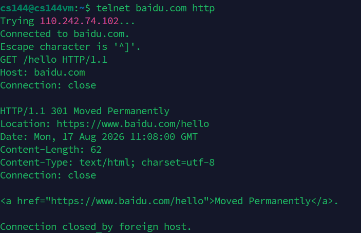
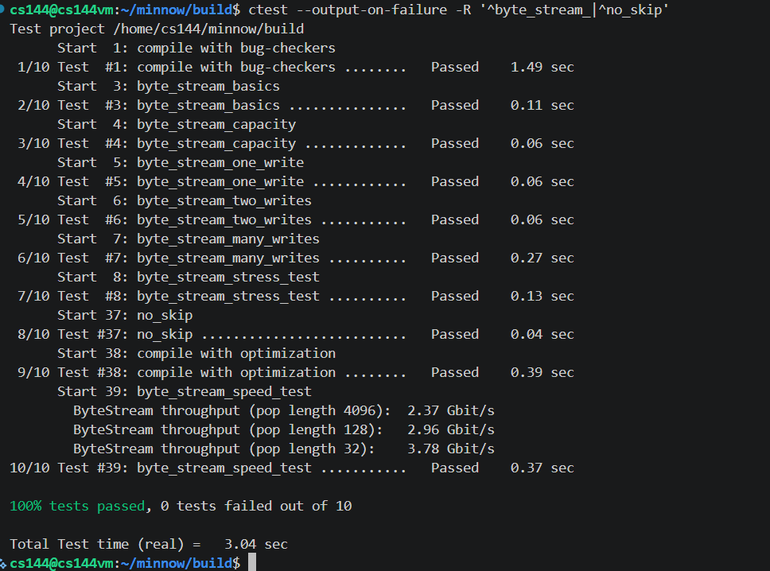

---

title: CS144-lab0

author: Muelsyse

pubDatetime: 2026-08-17T18:14:31+08:00

featured: true

draft: false

tags:
  - Computer Network
  - CS144

ogImage: ../../assets/images/cs144/cs144_lab0.png

description: CS144 Lab 0 实验记录：网络测试、WebGet 与 ByteStream 的实现。

---


最近在复习计算机网络，总觉得少了点编程实践，于是在 CSdiy 上找到了 CS144。昨天刚完成 Lab 0，这篇文章记录一下配置过程和我的实现思路。

## 配置虚拟机

我按照实验 PDF 的说明安装了 VirtualBox 并配置虚拟机，期间遇到了几个问题：

1. 虚拟机磁盘空间不足：实验提供的虚拟机磁盘只有 8 GB。通过 SSH 连接 VS Code 后，磁盘空间很快就满了，可能是安装 `C/C++ Extension Pack` 等扩展导致的。遇到这种情况，可以卸载不需要的扩展，或者直接扩容虚拟磁盘。
2. 宿主机无法通过 SSH 连接虚拟机：我在 VirtualBox 的网络设置中添加了端口转发，将宿主机的 `127.0.0.1:2222` 转发到虚拟机的 `22` 端口。之后连接宿主机的 `2222` 端口，VirtualBox 就会把流量转发给虚拟机中的 SSH 服务。
3. 虚拟机无法访问外部网络：因为宿主机平时开着代理，我在代理软件中启用了“允许局域网连接”，然后在虚拟机中配置代理地址和端口。我使用的端口是 `7890`，实际端口要以自己的代理软件配置为准。

## 测试

我可以通过 Telnet 连接 `cs144.keithw.org`，但无法正常发送请求，本机浏览器也访问不了这个网站。因此，我改用 `baidu.com` 测试，连接和请求都没有问题。



过程如下：

1. 客户端与服务器先建立 TCP 连接。
2. 虚拟机向 `baidu.com` 发送 GET 请求。
3. 服务器返回 HTTP 响应。这里的状态码是 `301 Moved Permanently`，表示请求的资源已被永久重定向，新的地址通常会放在 `Location` 响应头中。

Netcat 部分是在虚拟机中分别启动客户端和服务器，让两个本地进程通过网络套接字通信，过程比较简单。

## 编程任务

### WebGet

这一部分需要编写一个小程序，通过 TCP socket 向服务器发送 HTTP GET 请求，并打印服务器返回的响应。它的效果和前面手动使用 Telnet 测试类似。

```cpp
void get_URL( const string& host, const string& path )
{
  cerr << "Function called: get_URL(" << host << ", " << path << ")\n";
  // cerr << "Warning: get_URL() has not been implemented yet.\n";
  TCPSocket client_socket; // define the client socket
  Address server_address = Address(host, "http"); // define the server address

  client_socket.connect(server_address); // connect with the server
  std::string request = "GET " + path + " HTTP/1.1\r\nHost: "+ host + "\r\nConnection: close\r\n\r\n";
  client_socket.write((string_view)request);
  while(!client_socket.eof()){
    std::string response;
    client_socket.read(response);
    std::cout<<response;
  }
  client_socket.close();
}
```

### ByteStream

ByteStream 是一个有容量限制的字节缓冲区，可以把它理解成生产者与消费者之间的一条字节流。TCP socket 通常会维护发送缓冲区和接收缓冲区，后续实验中的 TCP 实现也会用到类似的抽象。

#### 基于 `std::queue` 的实现

最容易想到的方案是使用 `std::queue`，它符合“先进先出”的直觉。因此，我的第一版实现直接用 STL 队列存储每个字节，不过运行效率比较低。


主要问题出在 `peek()`。这个方法需要通过 `string_view` 返回缓冲区中一段连续的字节，但 `std::queue<char>` 的接口只能访问队首的单个元素，无法直接取得一段连续内存。因此，每次 `peek()` 最多只能返回一个字节，而 `read()` 会反复调用它，直到读满 `max_len` 或缓冲区变空。大量的小粒度调用带来了明显的额外开销。

#### 循环队列

为了减少 `peek()` 的调用次数，需要尽可能一次返回一段连续内存。因此，我改用 `std::vector` 实现循环缓冲区。

循环缓冲区常见的状态记录方式有两种：

- 使用 `head` 和 `tail`。可以把底层 `vector` 的大小设为 `capacity_ + 1`，并始终空出一个位置。此时 `head == tail` 表示队列为空，`(tail + 1) % buffer_.size() == head` 表示队列已满。
- 使用 `head` 和 `count`。`head` 指向当前可读数据的起点，`count` 记录缓冲区中的字节数，下一次写入的位置可以通过 `(head + count) % capacity_` 计算。

我的最终实现采用第二种方式，这样不需要把无符号类型的 `tail` 初始化为 `-1`，空和满也可以直接通过 `count` 判断。

`peek()` 还要处理数据绕回数组开头的情况。即使缓冲区中还有更多数据，一次返回的 `string_view` 也不能跨过 `vector` 的末尾。因此，从 `head` 开始可以连续读取的长度是 `min(count, capacity_ - head)`，剩余部分要等下一次 `peek()` 再返回。

写入时也可能在数组末尾发生回绕。使用 `std::copy` 最多分两段复制：第一段写到 `vector` 末尾，如果还有剩余数据，再从 `vector` 开头继续写入。

```cpp
void Writer::push( string data )
{
  if(is_closed() || data.size() == 0 || capacity_ == 0) return;

  const uint64_t write_pos = (head + count)%capacity_;
  const uint64_t n = min<uint64_t>(data.size(),available_capacity());
  const uint64_t first = min(n,capacity_ - write_pos);

  std::copy(data.begin(),data.begin() + first,buf_.begin() + write_pos);

  if(first < n){
    std::copy(data.begin() + first,data.begin() + n,buf_.begin());
  }
  count += n;
  pushed_bytes_nums += n;

}
```

测试结果如下图所示：



## 总结

Lab 0 本身不算难，反倒是配置虚拟机花了我不少时间。实现 ByteStream 时，最需要注意的是循环缓冲区的边界处理。这也是我第一次在实际代码中明显感受到数据结构和内存布局对性能的影响。
