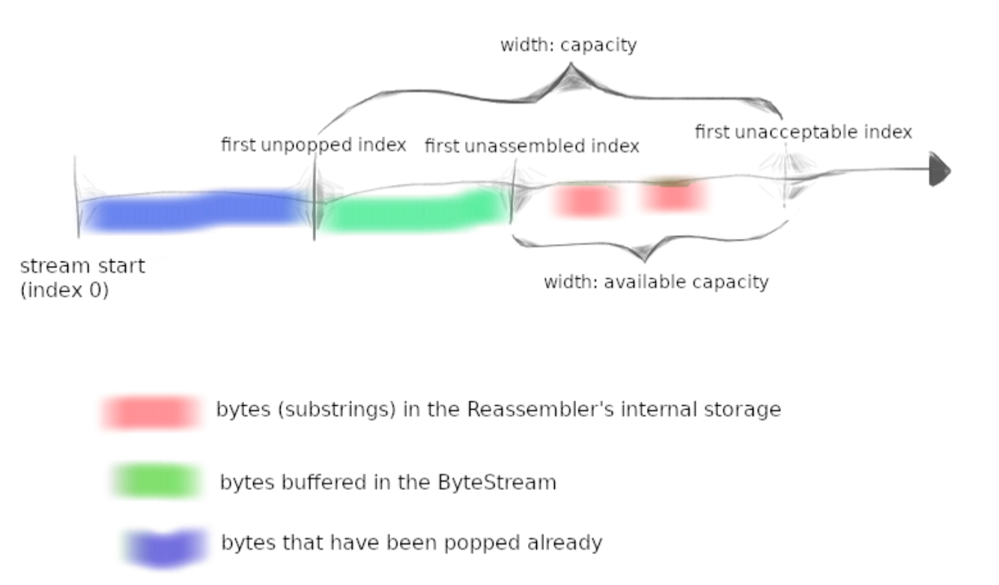
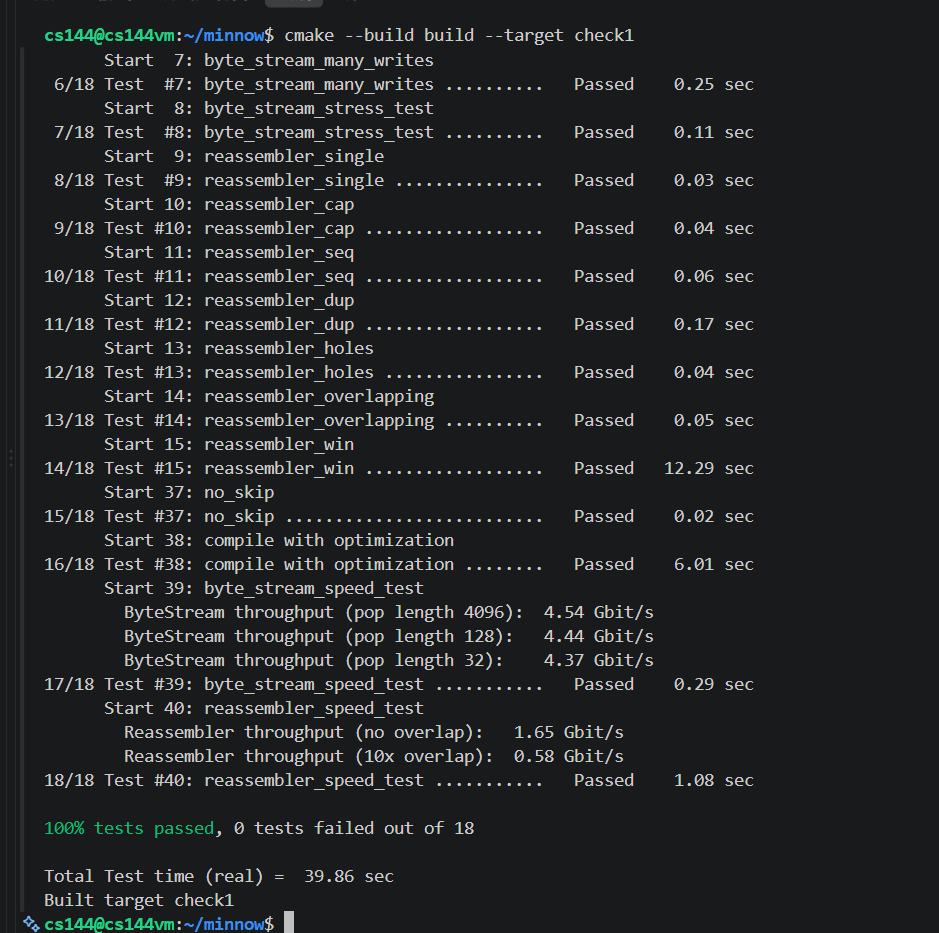
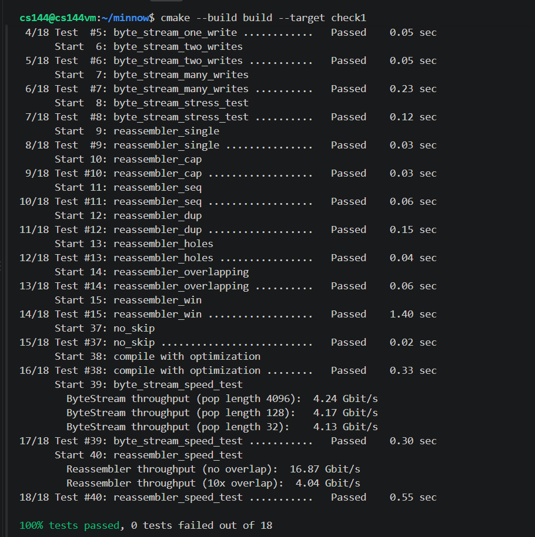

---

title: CS144-Lab1

author: Muelsyse

pubDatetime: 2026-08-17T20:26:12+08:00

featured: true

draft: false

tags:
  - Computer Network
  - CS144

series: CS144

ogImage: ../../assets/images/cs144/cs144_lab1.png

description: "CS144 Lab 1 实验记录: a Reassembler"

---
  

有了 Lab0 的基础, Lab1 写起来就更顺手一点, 主要是理解这个模型。  

## 一些知识

- Tcp 提供的是可靠的传输服务, 不过 IP 层及以下提供的是 "best-effort" 尽力而为的服务, 这就需要 Tcp 协议来处理 packets 的丢失、乱序、重复和错误。这个 Lab 我们实现了保证 Tcp的数据包可以按顺序到达。
- Tcp 传输时会把 bytestream 分割成 segments, 最大为 1500Bytes, 其中 40Bytes 为 Tcp header, 包含 源IP, 目标IP等字段剩下的为数据。
- 应用层：message 传输层：TCP segment / UDP datagram 网络层：IP packet 数据链路层：frame 物理层：bits

## 实现Reassembler
这里主要难点是理解这个模型, 并且我们需要处理重复的, 但不需要处理错误的。可以详细看看FAQ。

### 理解模型

首先 Lab 提出了三点要求:
1. Bytes that are the next bytes in the stream. The Reassembler should push these to the stream (output_.writer()) as soon as they are known.  
符合顺序的遇到了直接通过 `output_.writer()` 写入到缓冲区

2. Bytes that fit within the stream’s available capacity but can’t yet be written, because earlier bytes remain unknown. These should be stored internally in the Reassembler.
由于是乱序到达的,为了保证顺序还不能写入到缓冲区的先存入 Reassembler 中。
3. Bytes that lie beyond the stream’s available capacity. These should be discarded. The  Reassembler’s will not store any bytes that can’t be pushed to the ByteStream either immediately, or as soon as earlier bytes become known.
同时, 存储未来的数据不应该超过本身的 `capacity`, 这些丢弃就好。

 

如图所示, 这个一维图像表示 Tcp 接收方的接收缓冲区, 最左边的蓝色部分表示已经从 ByteStream 中 `pop` 出去了, 遇到这些字节说明重复了也不需要处理。 绿色部分表示已经写入缓冲区, 但是 `Reader` 还没有读走, 这部分是有序的。 红色部分表示乱序到达的且存储在 `Reassembler` 中的。 最后是超过 `capacity` 丢弃的。  

### 实现思路

首先 Lab 给出我们的函数定义 `void insert( uint64_t first_index, std::string data, bool is_last_substring );` 里面有下标和数据, `is_last_substring` 表示这个数据是否是最后一个数据。

对于接收到的数据, 我们应该考虑其那一部分是真正需要考虑的, 重复的不用考虑, 太后面超过 `capacity` 的也不用考虑。 那就剩下一个中间区间, 或者说一个窗口, 我们定义可以 `Writer` 可以写入的下一个字节的下标为 `next_index`, 则我们可以处理的窗口大小即为 `[next_index, next_index + available capacity)`, 也即是图中标为 `width: available capacity` 的部分。而随着 `next_index` 不断增加, 窗口也就不断向右滑动。

起初我不太理解为什么窗口大小可以直接是 `available capacity`, 我一直认为 `Reassembler` 的存储也会占用 `capacity`, 但是看图可以明白, 确实占用了, 不过占用的都是在 `available capacity` 内, 超出的部分直接丢弃就好了, 同时重复出现的也不需要再次存储, 所以最多也就是使用 `available capacity` 的空间。

我的想法就是首先我们只需要处理窗口内部的字节, 对于每个字节使用 `std::unordered_map` 维护, 如果不在 `Reassembler` 中就存上。 对数据处理完之后, 从 `next_index` 开始写入, 不过这里每一个字符就调用 `write()` 效率太低了, 所以可以把连续的字符存入 `string` 中, 最后一次 `write()`。 最后需要使用 `end_index` 和 `has_end_index` 来处理结尾, 后者表示是否收到结尾信息, 如果收到了再去比较 `next_index` 和 `end_index` 的关系。如果没有 `has_end_index`, 直接比较就会导致开始 `next_index == end_index == 0`, 直接结束了。

### 优化

这样实现太慢了,怎么优化?!
首先对于这个滑动窗口,我们需要每次都维护 `available capacity` 吗, 只要维护这个窗口和 `data` 交集就行了! 

并且我做了一系列可能的优化, 比如使用迭代器把 '判断是否存在, 存在加到 `string`, 删除该键值对' 三个访问 `unoodered_map` 的操作使用迭代器优化到一次, 比如使用 `emplace` 只有在 `key` 不存在时才会创建, 不过效果很一般, 结果如下图。

 
还能怎么优化呢? 我们的数据结构使用的是 `unordered_map`, 虽然查找的平均复杂度是 `O(1)`, 不过 `unordered_map` 用重量级的独立哈希节点保存每个字节(哈希桶；指针；节点管理信息；内存对齐产生的填充),并且哈希表每次操作都要计算哈希和定位桶,`erase` 通常会销毁节点并释放堆内存,也很贵。

那可以换什么数据结构? 注意到我们只需要维护一个最大长度是固定长度 `available capacity` 的区间, 我们可以使用一个循环数组维护这个区间, 每个数据存入下标 `i % capacity_`, 在访问的时候使用这个也是可以唯一确定一个下标的, 因为 `capacity_` 的大小是大于区间的,所以一定不会有重复。测试结果如下: 确实快了很多。

## 总结
这个 LAB 实现了 Tcp 的按序到达, 主要是理解这个模型, 搞清楚每一部分代表什么。
