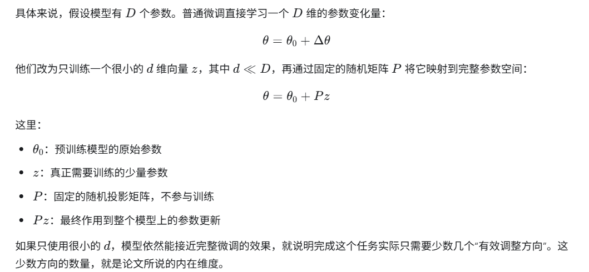
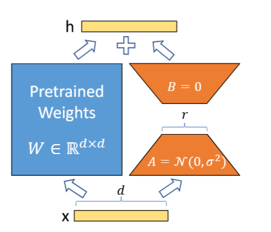
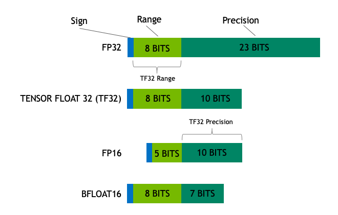

---
title: QLoRA

author: Muelsyse

pubDatetime: 2026-08-31T19:36:05+08:00

featured: true

draft: true

tags:
  - LLM quant
  - Paper Reading
  - LoRA

series: Papper Reading

description: "QLoRA 论文阅读和轻量级尝试"
---

## LoRA

对于 `pretrained` 的 model, 已经有了整体的知识, 想让其在某些下游任务上有更好的表现, 人们提出了 `fine-tuning`, 而全量微调需要的显存和算力都很高, 因为会更新所有的参数。 有人提出了只train一些参数,  但会增加模型的层数或者限制可用的 sequence length, 这样会引入 inference latency。并且有的方法微调后甚至达不到 base model 的效果。作者提出了LoRA, 思路来源于 "pre-trained language models have a low “instrisic dimension” and can still learn efficiently despite a random projection to a smaller subspace.", 预训练语言模型具有较低的“内在维度”。即使把参数更新限制在一个通过随机投影得到的低维子空间中，模型仍然能够有效地学习。解释如下:

如下图, LoRA 认为微调产生的变化的 `W` 是低秩的, 可以使用低秩分解(用两个较小的矩阵相乘表示一个较大的低秩矩阵)。比如微调后的权重 $W' = W + \Delta  W$, 只需要训练得到 $\Delta  W$ 即可(是不是有点类似于残差? 保持原来的部分, train不一样的部分)。总的来说LoRA 认为任务微调需要的权重变化可以由少数几个重要方向近似表达。

$$
h = W_0x + \Delta Wx
  = W_0x + \frac{\alpha}{r}BAx
$$
把 B 初始化为0, 保证最初的模型是 base model, 然后只训练更新 BA 即可, 冻结 base model 的参数。

LoRA 允许人们只训练很少的参数就可以微调一个大模型, 是一个基于适配器学习的PEFT算法。它指出模型往往是过参数化, 因此可以用两个低秩矩阵代替原来的密集连接, 从而可以减少模型的参数量。另外LoRA的适配器是一个和原模型的网络块并行的结构, 在推理时计算的是已经将适配器的参数加到原模型参数上的新参数, 因此不会带来任何的推理时间的增加。
## QLoRA
QLoRA 相对于 LoRA 主要是多了量化, QLoRA 使用了4bit量化。 显著降低了训练大模型使用的显存。QLoRA的优化有三个核心要点：首先是定义了一种4位标准浮点数（Normal Float 4-bit，NF4）量化，基于分块的分位数量化的量化策略；其次是双重量化，包含对普通参数的一次量化和对量化常数的再一次量化，可以进一步减小缓存占用；最后是分页优化器（Page Optimizer），用来在显存过高时用一部分内存代替显存。

### 数据类型

大模型的参数量很大, 如果使用较大(精度较高)的数据类型会导致使用模型时需要的显存较大, 所以有了模型量化, 旨在使用较小(精度较低)的数据类型存储大模型参数, 从而减小模型大小。

以下是常用的不同精度的数据类型, FP16 由于指数保留5位, 数字的数据范围很小, 很容易出现上溢和下溢。 训练的时候会出问题, 所以使用了 BF16, 保留8位指数, 7位小数, 牺牲了精度但保留了更大的范围。

虽然理想情况下训练和推理都应该在 FP32 中完成, 但 FP32 比 FP16/BF16 慢两倍, 因此实践中常常使用混合精度方法, 其中,使用 FP32 权重作为精确的 “主权重 (master weight)”, 而使用 FP16/BF16 权重进行前向和后向传播计算以提高训练速度, 最后在梯度更新阶段再使用 FP16/BF16 梯度更新 FP32 主权重。

在训练期间, 主权重始终为 FP32。在推理时, 半精度权重通常能提供与 FP32 相似的精度 —— 因为只有在模型梯度更新时才需要精确的 FP32 权重。这意味着在推理时我们可以使用半精度权重, 这样我们仅需一半 GPU 显存就能获得相同的结果。

但是以上精度所需显存还是太高了, 人们想出了 8 位量化, QLoRA 引入了 4 位量化。

### 量化

量化是从一种数据类型近似到另一种数据类型, 可以看成是一个分类问题, 一定范围的数据被量化到同一个数, 四舍五入式的 3.5 和 4.4 都会量化到4, 这个过程引入了噪声, 是有损压缩。

量化有两种常见的方式: **零点量化(zero-point quantization)** 和 **最大绝对值(absolute maximum quantization, absmax)量化**。
根据量化过程是否线性我们可以把量化分为线性量化和非线性量化。
**零点量化**分为两, 第一步值域映射, 即通过缩放将原始的数值范围映射为量化后的数值范围; 第二步零点调整, 即通过平移将映射后的数据的最小值对齐为目标值域的最小值。

absmax 量化,是让最大值量化到数据类型的最大值, 然后其他值根据这个量化常数放大, 反量化时使用这个常数缩小。公式如下:

$$
\mathbf{X}^{\mathrm{Int8}}
=
\operatorname{round}
\left(
\frac{127}
{\operatorname{absmax}\left(\mathbf{X}^{\mathrm{FP32}}\right)}
\cdot
\mathbf{X}^{\mathrm{FP32}}
\right)
=
\operatorname{round}
\left(
c^{\mathrm{FP32}}
\cdot
\mathbf{X}^{\mathrm{FP32}}
\right)
\tag{1}
$$

反量化:

$$
\operatorname{dequant}
\left(
c^{\mathrm{FP32}},
\mathbf{X}^{\mathrm{Int8}}
\right)
=
\frac{\mathbf{X}^{\mathrm{Int8}}}
{c^{\mathrm{FP32}}}
=
\mathbf{X}^{\mathrm{FP32}}
\tag{2}
$$

这样做有一个问题是如果最大值是一个异常值, 会导致其他量化后的值都集中在某个值附近, 导致量化的其他值基本用不上。

### 分位数量化

分位数量化是非线性量化,
