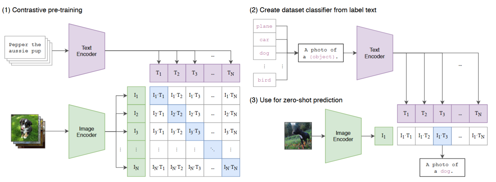
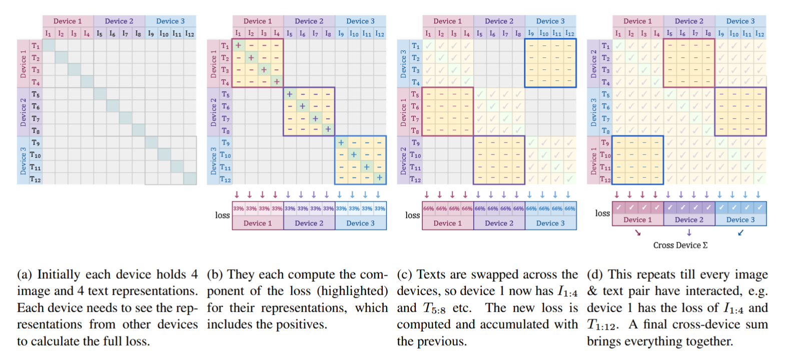
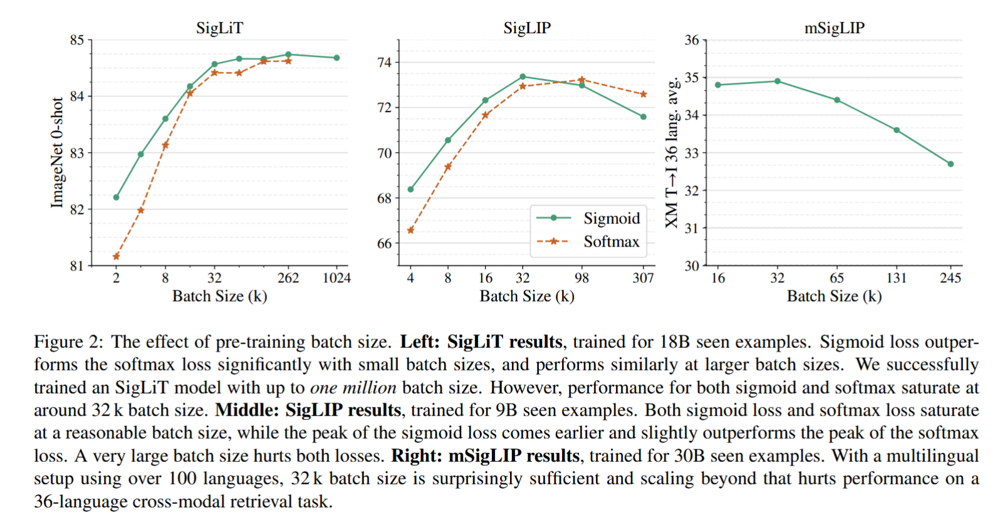

## 从对比学习到SigLIP

计算机视觉领域的大部分任务都是有监督的, 比如分类, 语义分割。 但是有监督的任务有一个很大的问题是对图片的理解能力太单调了, 一张图片最后被归类到一个很简单的 `label` 比如 "摩托车", 这有两个问题:

1. 对于不属于类别里的图片没办法给出很好的结果, 比如训练时类别只有 `摩托车`, `卡车`, 而测试时输入一个 `三轮车`, 只能给出最相近的类别。

2. 对于语义丰富的图片, 就比如上面的那张图, image capation 比如是 "一个少女捧着一束花站在花丛中", 这很难给其一个具体的标签, 总会造成语义损失。

所以提出了对比学习, 这是一种无监督学习(自监督学习), 通过学习 \<image, text\> 配对, 将图片和语义嵌入到同一种空间中, 将图片和对应文本建立联系, 模型就能看懂图片的语义了。 `CLIP`是这个领域的代表性工作, 其预训练的`VIT` 被广泛用作多模态大模型的 `vision encoder`. `CLIP` 结构如图所示:

左图是 `pre-training` 的结构, 通过训练图像编码器和文本编码器, 让它们把语义匹配的图像与文本映射到同一个向量空间中的相近位置。 计算出所有图片和文本之间的相似度, 希望对角线(正样本)的相似度大, 负样本的相似小, 使用双向的交叉熵损失来训练。本质上可以看成是两个多分类问题。

设一个 batch 中有 $N$ 对图文样本，归一化后的图像特征和文本特征分别为：

$$
\hat{\mathbf{i}}_k
=
\frac{\mathbf{i}_k}{\lVert \mathbf{i}_k\rVert_2},
\qquad
\hat{\mathbf{t}}_k
=
\frac{\mathbf{t}_k}{\lVert \mathbf{t}_k\rVert_2}.
$$

图像 $i$ 与文本 $j$ 的相似度 logit 为：

$$
s_{ij}
=
\frac{\hat{\mathbf{i}}_i^\top\hat{\mathbf{t}}_j}{\tau},
$$

其中 $\tau>0$ 是温度参数。

图像到文本的对比损失为：

$$
\mathcal{L}_{I\rightarrow T}
=
-\frac{1}{N}
\sum_{i=1}^{N}
\log
\frac{\exp(s_{ii})}
{\sum_{j=1}^{N}\exp(s_{ij})}.
$$

文本到图像的对比损失为：

$$
\mathcal{L}_{T\rightarrow I}
=
-\frac{1}{N}
\sum_{i=1}^{N}
\log
\frac{\exp(s_{ii})}
{\sum_{j=1}^{N}\exp(s_{ji})}.
$$

最终的 CLIP 损失为两个方向损失的平均：

$$
\mathcal{L}_{\mathrm{CLIP}}
=
\frac{1}{2}
\left(
\mathcal{L}_{I\rightarrow T}
+
\mathcal{L}_{T\rightarrow I}
\right).
$$

而 SigLIP 是把这里的用到的 `softmax` 函数换成了 `sigmoid`。 作者认为 `softmax` 有数值不稳定, 同时分布式计算时效率不高(需要两次 all-gather, 如果减去 max 保证稳定, 每个还需要再多一次), 同时将任务和 `batch_size` 解耦, 在小的 `batch_size` 上也有较好的效果。同时把 `CLIP` 的多分类问题变成了二元分类问题, 从 "和哪一个相关" 变成 "相不相关"。

## 方法

如上文所说, `SigLIP` 是将 `CLIP` 的 loss 变成了 sigmoid, 具体 loss 如下:

$$
\mathcal{L}
=
-\frac{1}{|\mathcal{B}|}
\sum_{i=1}^{|\mathcal{B}|}
\sum_{j=1}^{|\mathcal{B}|}
\log
\underbrace{
\frac{1}{
1+
e^{
z_{ij}
\left(
-t\,\mathbf{x}_i\cdot\mathbf{y}_j+b
\right)
}
}
}_{\mathcal{L}_{ij}}
$$

`CLIP` 在算 `softmax` 的时候需要两次 `all-gather` 操作, 把不同 GPU 的 feature 汇聚,开销很大, 同时每个GPU都需要保存一个 batch 的feature, 然后才能计算 `softmax`, 而文中提出的实现不需要使用 `all-gather` 操作, 只需要 $D$ 次轮转即可, 同时只需要保存 $b\times b$ 的 logits,  计算完即可释放, 显存开销也小。 具体如下图所示:

一个 batch 有 12 个样本, 分到 3 个设备中分别计算, 每次都以计算loss的一部分最后相加即可, 3个设备只需要轮转3次。
每轮拿到一个文本特征块，计算当前 $b\times b$ 图文对的 sigmoid loss，把这个标量加到总 loss 中，然后当前 logits 块就不再需要了，可以释放并处理下一块。

## 实验

文章做了大量实验, 有一个很明显的问题是 SigLIP 在小 batch 时的效果比 CLIP 好, 同时 SigLIP 由于计算方式更少的计算资源。

同时作者发现 batch 在 $32k$ 时趋于饱和, 而大的 batch 需要更多的时间和样本训练才能达到更好的效果。