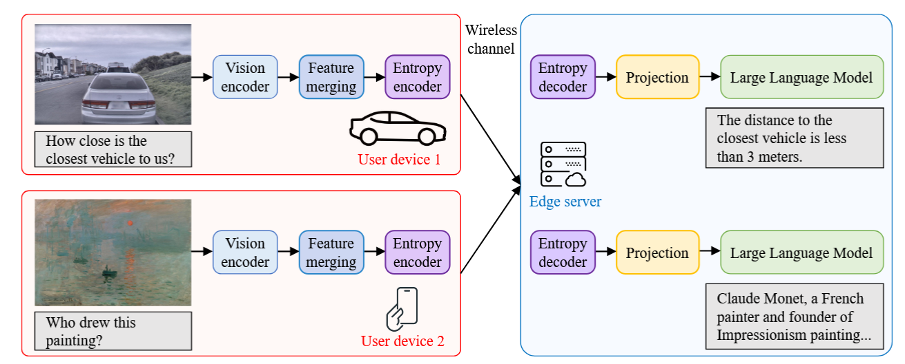
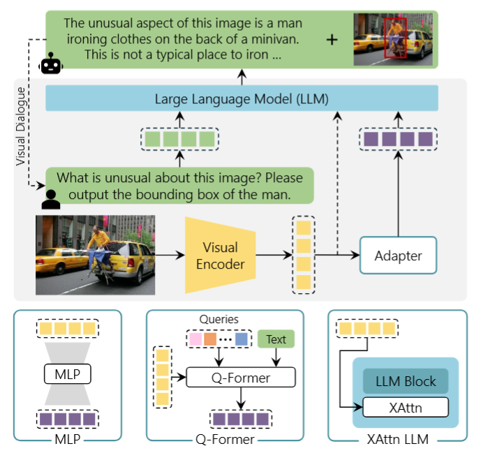
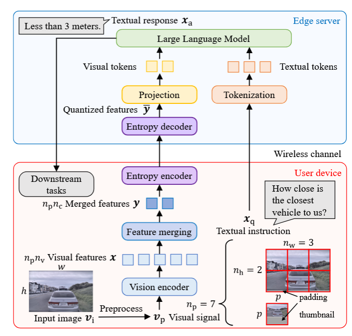
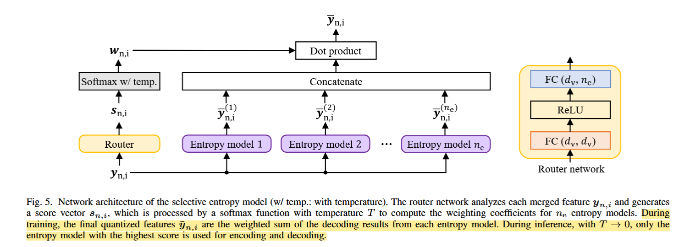

## 这篇文章做了什么?

为了解决当前 LMM 用户使用时由于网络通信和推理时的计算而导致的延迟, 文章主要在端到端的传输上下功夫, 通过面向任务(Task-Oriented) 的压缩传输的信息(主要是视觉信息)来减少网络通信的时间和成本(计网中我们学过, 用户端的上行带宽一般很小), 同时减少 LMM 在 Server 的推理计算量, 在保证推理能力的同时提升速度, 从而提升了用户体验。不过文章似乎没有在极端的网络环境下做实验。

首先, 目前我们使用的 AI 基本上都是 'Server Only', 也就是用户端只管发, 计算推理全在 Server 端, 首先这样传输的数据压缩方式一般是传统的压缩方式(比如 pixel 的), 会有冗余信息比如好多像素都是在描述 `sky`, 最后真正对 inference 有用的可能很少, 同时这种压缩力度不够大(这些冗余信息可以压缩), 不仅在通信上会有延迟, 在计算上 LMM 通过 vision encoder 得到的视觉 token 更多, 导致 Server 端计算量很大, 从而导致面对实时性的任务表现效果很差。 我能想到的比如在具身的场景中中, 越快的推理意味着越快的行动。还有自动驾驶, 需要及时的推理保证紧急情况下的安全性。所以这篇文章使用了一个 LMM '云端协同推理' 的框架 (a device-edge co-inference framework),在此基础上提出了任务驱动的特征压缩方法。



### LMM 怎么工作的?

如下图所示(图片来自https://arxiv.org/abs/2402.12451), 现在的LMM 基本上由三个部分构成: a visual encoder, a language model, and an adapter module that connects visual inputs to the textual space. 将 encoder 得到的 vision feature 通过 adapter 变成 LLM 可以理解的 语义信息, 从而使用 LLM 进行推理, 这种方式利用了预训练的 vision encoder 比如 Clip, 推理也可以使用预训练的 LLM(不过也有自己重新训练的,像 LLaVA。)。这种方式是很高效且便宜的, 不再需要从头开始 train 一个 model。



### Task-Oriented Communication

有一个很明显的问题是我们发送的图片是给LLM看的, 传统的图片传输方式可能适合人, 但不一定适合 LLM, 我们应该传输 LLM 想要的数据保证其 inference 能力, 也就是 'Task-Oriented', 针对下游任务提供 LLM 需要的信息。原文中这样说 "extracts task-relevant information and transmits only the essential features to the edge server, which handles the extensive computation of model inference."

### 特征压缩

传统的方式数据压缩方式是通过压缩原始的图片来保证通信,这种 pixel 级别的方式太暴力了,会有上述的冗余信息的问题,并且可能会损失部分语义信息。 而减少 vision token 的方法大多是在 adapter 之后做的, 这时 vision token 的维度已经扩到的 LLM 的 latent space 了, 此时维度太高要传输的信息就太多了, 它只能降低服务器上的 LLM 计算开销，无法降低已经发生的设备—边缘传输量。应该尝试先传输 vision feature, 在 server 端进行投影和推理。针对上述这两个问题, 这篇文章采用 'feature compression' 并且在 Server 端进行投影。

## 方法

文章的整体架构图如下所示:



### System Model

输入是图片和文本指令, 后者由于数据小可以直接tokenizer, embedding 之后变成 token; 而图片本文采用了 LLaVA的方法, 原图像为 $h \times w \times 3$, 将其放大填充后切分成 $n_{h} \times n_{w}$ 个 tile, 在主实验中每个 tile 大小为 $384 \times 384$, 而 SigLIP 将每个 tile 切成 $14 \times 14$ 的 patch, 每一个 tile 一共就有 $27 \times 27 = 729$ 个token, 最后再加上一个被 resize 成 $384 \times 384$ 缩略图。所以一个图像被分成 $n_{p} \times p \times p \times 3$ 的大小,其中 $n_{p} = n_{h} \times n_{w} + 1$, $p = 384$。进入 encoder 之后变成 $n_{p} \times n_{v} \times d_{v}$,其中 $n_{v} = 729$, $d_{v} = 1152$。 这里有个问题是 $384$ 并不能整除 $14$, 不过 vit 的分割 patch 的实现是用卷积做的 `Conv2d(in_channels=3, out_channels=1152, kernel_size=14, stride=14, padding=0)` 大概类似这样, 最后得到的也就是 $((384 - 14) // 14) + 1 = 27$。

将encoder之后得到的 vision feature 送入 TOFC 的 特征融合模块, 得到聚合后的特征之后送入可选择的熵模型编码, 在 Server 端解码得到 vision feature, 再进行投影变成 token 传入 LLM。 先减少了feature, 再投影。既减少了传输时间, 也减少了(token减少)计算时间。

这篇文章提出的方法主要由三部分组成: Clustering-Based Feature Merging, Learnable Entropy Model-Based Codec,
Selective Entropy Model。

### Clustering-Based Feature Merging

图片处理后得到 $n_{p} \times n_{v} \times d_{v}$, 文章通过聚类将 $n_{v}$ 减少到 $n_{c}$。 文章采用了 DPC-KNN 的聚类方法, 成为聚类中心要符合两个条件: 局部密度高(这里选用K个), 与更高密度距离远, 前者表示你可以代表你周围的部分群体, 后者表示你是独特的, 你身边没有密度更高的来代表你。具体公式如下:

$$
\begin{equation}
\rho_{n,i}
=
\exp\left(
-\frac{1}{K}
\sum_{\boldsymbol{x}_{n,j}\in
\operatorname{KNN}(\boldsymbol{x}_{n,i},K)}
d\left(\boldsymbol{x}_{n,i},\boldsymbol{x}_{n,j}\right)^2
\right).
\tag{1}
\end{equation}
$$

$$
\begin{equation}
\delta_{n,i}
=
\begin{cases}
\displaystyle
\min_{j:\,\rho_{n,i}<\rho_{n,j}}
d\left(\boldsymbol{x}_{n,i},\boldsymbol{x}_{n,j}\right),
&
\text{if } \exists j,\ \rho_{n,i}<\rho_{n,j},
\\[6pt]
\displaystyle
\max_j
d\left(\boldsymbol{x}_{n,i},\boldsymbol{x}_{n,j}\right),
&
\text{otherwise}.
\end{cases}
\tag{2}
\end{equation}
$$

$\rho_{n,i}$ 表示第 $n$ 个 patch(/tile) 的第i个feature 和周边 K 和 feature 的平均密度大小(0~1)。比如第 $3$ 个 patch 的第 728 个 feature, 是 $1152$ 维的。 $\delta_{n,i}$表示与更高密度 feature 的距离, 使用两者乘积 $\rho_{n,i} \times \delta_{n,i}$ 来选择聚类中心。

最后对每个簇内的 feature 求平均得到融合的 feature **$y$**。

这种自适应的聚类的优势是 training-free, 并且自适应能够让相同的聚到一块, 这样的特征减少不会导致过分的语义信息丢失, 同时对于不同种类的图片具有很高的泛化性。

> [!NOTE] ✏️ A question
> 写到这里我突然有一个问题: 为什么一定要传图片? 为什么不传 image capation,因为我看 LLaVA 的第一篇论文中 GPT4 只看文本不看图片也能做的很好, 并且它的数据集也是 GPT4 不看图片生成的。answer: 不过需要人描述, 并且描述来的没有图片直观。 deepseek 的识图模式是怎么做的? 或者说可以用户传上去图片, model 先做 image capation, 然后再推理?这样不久避免了直接将vision feature转变成token 我之后去看看这个问题怎么回答。

### Learnable Entropy Model-Based Codec

这里的整体思路跟 Variational Image Compression with a Scale Hyperprior 基本一致, [text](https://arxiv.org/abs/1802.01436)
首先解释一下什么是熵模型, 信息论中我们认为每个数据出现是有概率的, 即服从一定的分布, 真实的分布没法得到, 我们用熵模型来预测这个分布(本文使用拉普拉斯分布), 具体点是预测这个分布的参数。 有了分布就有可以熵编码了。

假设真实分布为 $P$, 理论最低平均码长是熵: $H(P)=- \sum_x P(x)\log_2P(x)$, 我们训练一个熵模型 $Q _\theta$ 去近似它, 那实际码长为 $\mathbb E_{x\sim P} [-\log_2Q_\theta(x)]$, 这个公式是交叉熵。可以分解为:

$$
\mathbb{E}_{P}\left[-\log_{2} Q_{\theta}(X)\right]
= H(P) + D_{\mathrm{KL}}\left(P \parallel Q_{\theta}\right)
$$

前者是数据的信息量, 后者是 KL 散度, 表示熵模型预测不准造成的额外码长。

我们得到的是 $n_{p} \times n_{v} \times d_{v}$,其中 $n_{v} = 729$, $d_{v} = 1152$, 引入超先验$z$ 通过一个神经网络 $h_a$ 得到, 都是浮点数, 如果全用浮点数编码的话, 比如 FP16, 消耗存储太大了, 这里使用有损编码, 先对数据量化 (Quantized) 再编码。

下面这版可直接粘贴到 Markdown。我修正了 `\miu`、下标转义和量化符号，并补充了 TOFC 后续使用 STE 的说明。

$z$ 是一种超先验辅助信息，可以理解为对待传输特征的“说明书”。如果没有 $z$，解码端就无法直接获得拉普拉斯分布的参数 $(\mu,b)$。一种做法是在编码端计算 $(\mu,b)$ 并直接传输，但它们的维度与 $y$ 处于同一量级，传输开销很大。因此，TOFC 只传输维度更小的量化超先验 $\bar z$，解码端再通过超先验合成网络 $h_s$ 得到：

$$
(\mu,b)=h_s(\bar z).
$$

对于量化，论文首先使用加性均匀噪声进行描述：

$$
\bar y=y+o,
\qquad
o\sim\mathcal U(-0.5,0.5).
$$

这是神经压缩中常见的量化近似。由于真正的取整操作不可导，训练时可以用加性均匀噪声近似量化误差；测试和实际编码时则执行真正的取整量化。

不过，TOFC 随后又在公式 (7) 和公式 (8) 中引入了直通估计器（STE）：

$$
\bar y=\operatorname{STE}(y-\mu)+\mu,
$$

$$
\bar z=\operatorname{STE}(z-\mu_{1/2})+\mu_{1/2}.
$$

STE 在前向传播时执行真正的取整，在反向传播时则近似令梯度直接通过。论文没有清楚解释均匀噪声与 STE 的具体分工，公开源码的训练配置主要采用无噪声概率估计与 STE 硬量化。

但是 文中后面又说使用的 STE 的 方式, forward 时看成是 round(·), backward 时看作恒等函数, 这样就可以方向传播了。 我看了源码两种实现是都有的, 但是训练脚本使用的是后者。

由于 $y$ 和 $z$ 都是被量化成 $y_offset$, $z_offset$, 我们的概率应该使用离散的概率 PMF, 也即是对一个数求其 (-0.5, 0.5) 的密度函数的积分, 得到离散的CDF。文中用了和均匀分布卷积的形式, 是一样的。

文中的 Loss 也是两个部分, Rate 和 Distortion, 其中 Distortion 是 LLM 的损失。

$$
\begin{equation}
\mathcal{L} = D + \lambda R.
\tag{4}
\end{equation}
$$

$$
\begin{equation}
D
=
-\frac{1}{T}
\sum_{t=1}^{T}
\log p\left(
x_{a,t}
\mid
x_{a,1},\ldots,x_{a,t-1}
\right).
\tag{5}
\end{equation}
$$

对于 $R$, 对于一个给定的图片来说, 理想熵是:

$$
\begin{equation}
\begin{aligned}
H(\bar{y},\bar{z})
&=
H(\bar{y}\mid\bar{z}) + H(\bar{z}) \\
&=
\mathbb{E}_{v_i\sim p_{v_i}}
\left[
-\log p_{\bar{y}\mid\bar{z}}
\left(\bar{y}\mid\bar{z},v_i\right)
-\log p_{\bar{z}}
\left(\bar{z}\mid v_i\right)
\right].
\end{aligned}
\tag{11}
\end{equation}
$$

但数据的真实分布不知道, 使用我们用神经网络预测的来代替: 这里应该是真实数据的概率, 对预测分布的熵。 准确的说:真实分布的熵，也就是知道真实分布时能够达到的理论最优平均码长，小于等于使用神经网络预测的概率分布编码真实数据时得到的平均码长。 这里的公式我觉得写的不好理解, 可以使用 $p$, $q$ 来区分真实分布和预测的分布的。

$$
\begin{equation}
\begin{aligned}
H(\bar{y},\bar{z})
\leq{}&
\mathbb{E}_{\bar{y}\sim p(\bar{y}\mid\bar{z})}
\left[
-\log p(\bar{y}\mid\bar{z})
\right] \\
&+
\mathbb{E}_{\bar{z}\sim p(\bar{z})}
\left[
-\log p(\bar{z})
\right].
\end{aligned}
\tag{12}
\end{equation}
$$

这个熵是大于真实熵的, 最后使用以下公式, 不过这里没有写求和可能是对于一个来说, 源码是有求和的。

$$
R
=
-\frac{1}{n_p n_c d_v}
\left(
\log p(\bar{y}\mid\bar{z})
+
\log p(\bar{z})
\right).
$$

```python
nbits = (
    torch.log(y_likelihoods).sum()
    + torch.log(z_likelihoods).sum()
) / -math.log(2)

self.rate = self.rate + nbits / y_likelihoods.numel()
```

写成下面的形式可能更好理解一点:

$$
R
=
-\frac{1}{n_p n_c d_v}
\left[
\sum_{i=1}^{n_p n_c d_v}
\log_2 p\left(\bar{y}_i \mid \bar{z}\right)
+
\sum_{j=1}^{n_p n_c d_v/16}
\log_2 p\left(\bar{z}_j\right)
\right].
$$

### MOE

图片是多样的, 单纯的一个熵模型编码所有特征的熵会大一点, 所以文章引入了MoE。



通过 Router 网络求得一个对 16 个专家的分数 通过带温度的 Softmax 变成权重 $w_{n,i}$, 权重和每个 Entropy Model 做点积, 最后得到最终的特征。 注意 train的时候是在一台设备进行的。推理的时候使用的权重计算最高的专家。

$$
\bar{\mathbf{y}}_{n,i}
=
\sum_{e=1}^{n_e}
w_{n,i}^{(e)}
\bar{\mathbf{y}}_{n,i}^{(e)} .
\tag{15}
$$

由于使用了多个专家, rate loss 也要求取平均值:

$$
R
=
-\frac{1}{n_p n_c d_v}
\sum_{e=1}^{n_e}
w_{n,i}^{(e)}
\left(
\log p\left(
\bar{\mathbf{y}}^{(e)}
\mid
\bar{\mathbf{z}}^{(e)}
\right)
+
\log p\left(
\bar{\mathbf{z}}^{(e)}
\right)
\right) .
\tag{16}
$$

权重计算公式如下:

$$
w_{n,i}^{(e)}
=
\frac{
\exp\left(s_{n,i}^{(e)}/T\right)
}{
\displaystyle
\sum_{e=1}^{n_e}
\exp\left(s_{n,i}^{(e)}/T\right)
} .
\tag{17}
$$

由于采用了MoE, 为了保证所有专家都能够参与, 引入了负载均衡损失:

$$
\mathcal{L}_{\mathrm{balance}}
=
\alpha
\sum_{e=1}^{n_e}
\left(
\frac{1}{n_p n_c}
\sum_{n=1}^{n_p}
\sum_{i=1}^{n_c}
w_{n,i}^{(e)}
-
\frac{1}{n_e}
\right)^2 .
\tag{18}
$$
## 思考
第一次看到方法的第二部分熵模型的时候一下子想到了生成模型, 像 VAE, DDPM, 神奇的是 在我翻阅参考文献时有这样一篇: '[Variational image compression with a scale hyperprior](https://arxiv.org/abs/1802.01436)', 第一句话就说 'We describe an end-to-end trainable model for image compression based on variational autoencoders.' 不禁让我思考 `生成` 和 `压缩` 的关系, 就目前我的知识而言, 我认为压缩类似于 'AutoEncoder', 生成是真正的 `VAE`, 同时压缩之后重建是为了让人看的清楚, 不损失人所捕捉的信息, 但是像这篇文章传输图片是给 LLM 看的, 是否就不需要像重建一样保证图像的人眼所见的损失? 只保留 LLM 需要的信息即可, 也就是说不需要达到优秀的重建效果, 那是否生成也可以? 既然熵模型也是利用神经网络预测分布, 跟 VAE 如出一辙, 那我们能否使用神经网络近似 image feature 的分布?  这样传输潜变量就可以了, demension 会低很多, 之后在 server 端生成 image token。 我认为 image feature 是低秩的, 不需要像1152维这样多, 所以潜变量的传输是有可能正确的。 但是有一个问题是 怎么保证信息不丢失? 我目前的理解是通过训练, 核心的特征是不会丢失的, 生成 LLM 的需要的 feature 就行了。 之后我在看看有没有别的文献做这个的。

我认为将这两件事联系到一起的很重要的观点是 *信息论*,  LLM 的 loss 就是交叉熵, 只是 predict next token, 预测的也是 下一个 token 的分布, 不过最后处理的时候让 label 处为1了。